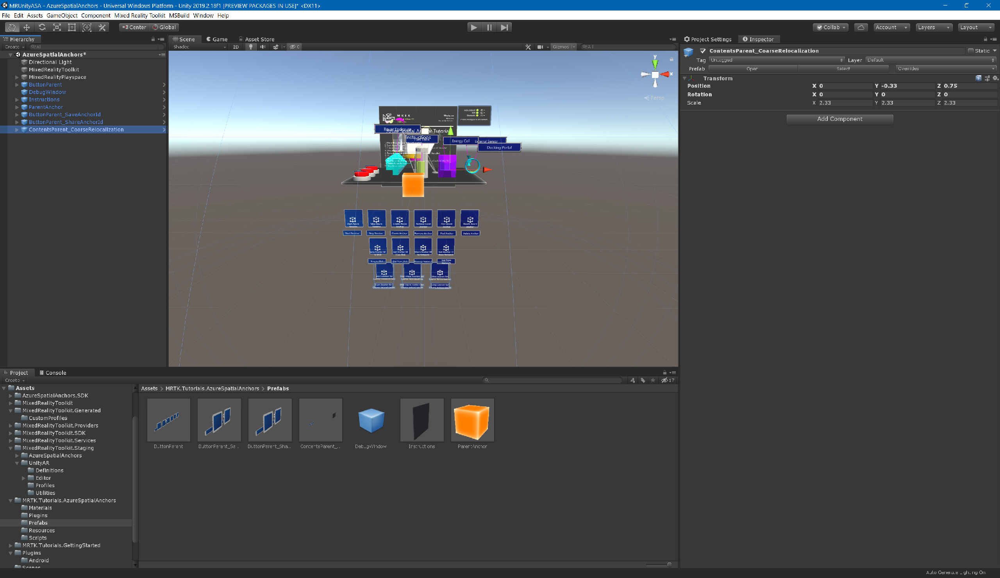
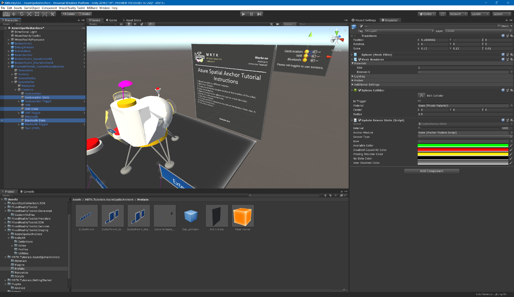

# 4. Saving, retrieving using coarse relocalization

## Overview

In this tutorial, you will learn how to save Azure Spatial Anchors across multiple app sessions by using coarse relocalization. You will also learn how to use sensor device information to other devices for a multi-device anchor alignment.

## Objectives

* Learn how to retrieve the anchors in the area around the sensor device, for persistence between app sessions
* Learn how to share Azure Spatial Anchors between users in a multi-device scenario

## Prerequisites

>[!TIP]
>If you have not completed the [3. Displaying Azure Spatial Anchor feedback](https://docs.microsoft.com/en-US/windows/mixed-reality/mrlearning-asa-ch3) series yet, it's recommended that you complete those tutorials first.

## Importing the tutorial assets

Download and **import** the following Unity custom packages **in the order they are listed**:

* [MRTK.HoloLens2.Unity.Tutorials.Assets.AzureSpatialAnchors.addtional4.unitypackag](./MRTK.HoloLens2.Unity.Tutorials.Assets.AzureSpatialAnchors.addtional4.unitypackag)

> [!TIP]
> Importing assets, overwrite AnchorModuleScript.cs

## Preparing the scene

In the Project window, navigate to **Assets** > **MRTK.Tutorials.AzureSpatialAnchors** > **Prefabs** folder. click on **ContentsParent_CoarseRelocalization** to select the prefabs, then drag them into the Hierarchy window to add them to the scene:

## Settings Azure Spatial Anchors - to use the sensor information.

In this section,you wil learn how to set Azure Spatial Anchors to use the sensor information.This will allow you to create the anchor with the sensor information.

In the Project window, expand the MRTK.Tutorials.AzureSpatialAnchors > Resources folder which contains CoarseRelocalizationConfig.Select and configure the settings:

* Near Device Settings
  * Distance in Meters
  * Max Result Count
* Geo Location Enabled (always set false.HoloLens/HoloLens 2 isn't supported. )
* Wifi Enabled
* Bluetooth settings
  * Bluetooth Enabled
  * Known Beacon Proximity UUids(if **bluetooth enabled** was enabled,uuids of beacon(iBeacon/Eddystone) must set.)  

## Persist Azure Anchors between app sessions - Save anchor including the sensor infomation.

In this section, you will learn how to save and retrieve theier Azure Anchors using Sensor devices. This will allow you to query Azure for the some anchors between different app sessions, allowing the anchored holograms to be position at the same location as in the previous app session.

In the Hierarchy window, expand the ContentsParent_CoarseRelocalization > Buttons object which contains three buttons, one button for starting the session to set the sensor device and another for stopping the session,last for retrieving their Spatial Anchors.

Follow the same steps as in the [configuring the buttons to operate the scene](mrlearning-asa-ch1.md#configuring-the-buttons-to-operate-the-scene) instructions from the previous tutorial to configure the **Pressable Button Holo Lens 2 (Script)** component and the **Interactable (Script)** component on each of the two buttons:

* For the **StartAzureSessionForCoarseRelocalization** object, assign the AnchorModuleScript > **StartAzureSessionForCoarseRelocalization ()** function.
* For the **FindAzureAnchorsForCoarseRelocalization** object, assign the AnchorModuleScript > **FindAzureAncorForCoarseRelocalization ()** function.
* For the **StopAzureSessionForCoarseRelocalization** object, assign the AnchorModuleScript > **StoptAzureSessionForCoarseRelocalization ()** function.

Next,in the Hierarchy window, expand the ContentsParent_CoarseRelocalization > SensorInfos > Contents object which contains some objects,and update **GeoLocation State**,**Wifi State**, and **Bluetooth State**

With the **GeoLocation State** object still selected in the Hierarchy window, click-and-drag the ParentAnchor object from the Hierarchy window into the empty None (Object) field of the **Update Sensor State** you just added to make the ParentAnchor object listen for the sensor state.
Update **Wifi State** object and **Bluetooth State** object in the same way as **GeoLocation State** object.

In addition,you set the below application capabilities for Using the Sensors:
(see also [1. Getting started with Azure Spatial Anchors - 1. Add additional required capabilities](https://docs.microsoft.com/en-US/windows/mixed-reality/mrlearning-asa-ch1#1-add-additional-required-capabilities))

* Bluetooth

The below capabilities should be already enabled.

* InternetClient
* Microphone
* SpatialPerception
* InternetClientServer
* PrivateNetworkClientServer
* RemovableStorage
* Webcam

If you build the updated application to your HoloLens, you can now persist Azure Spatial Anchors between app sessions by including the sensor infomations in the Azure Anchor. To test it out, you can follow these steps:

1. Move the Rocket Launcher experience to desired location.
2. Toggle on/off the sensors that you'd like to use.
3. Start Azure Session For Coarse Relocalization.
4. Create Azure Anchor (creates anchors at the location of the Rocket Launcher experience).
5. Restart the application.
6. Toggle on/off the sensors that you'd like to use. (same settings as creating anchors)
7. Start Azure Session For Coarse Relocalization.
8. Find Azure Anchor For Coarse Relocalization.(positions the Rocket Launcher experience at the location from step 4).
9. Delete Anchor(if you don't delete anchor,you retrieve some anchors after next time.)

## Congratulations

In this tutorial you learned how to persist Azure Spatial Anchors between application sessions and application restarts by saving the Azure Spatial Anchor with the sensor infomations. You also learned how to share Azure Spatial Anchors between multiple devices for a basic multi-user, static hologram shared experience.
