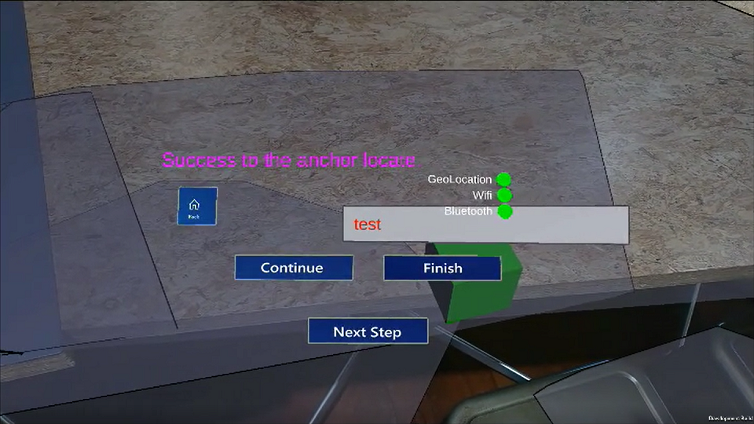
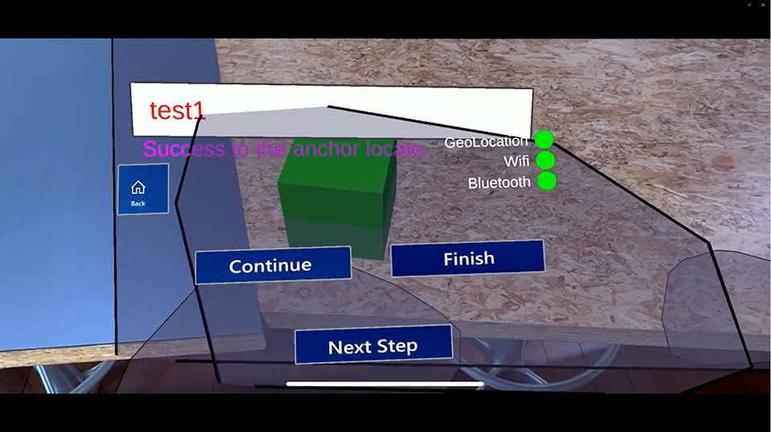
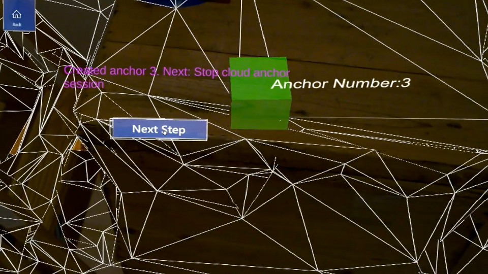

# AzureSpatialAnchorsSamplesOnMRTKV2
This project is some samples of Azure Spatial Anchors,also it is Experimental Project for cross-platform development using Mixed Reality Toolkit V2

## Sample Projects
There are the below projects in this repository.

|name|type|description|
|:-:|:-:|:--|
|azure-spatial-anchors-samples|Unity|
This Sample is unity sample project on [azure-spatial-anchors-samples](https://github.com/Azure/azure-spatial-anchors-samples).  that upgraded using MRTK V2.

libralies version:<ul><li>[AzureSpatialAnchors v2.1.1](https://github.com/Azure/azure-spatial-anchors-samples/releases/tag/v2.1.1) </li><li>[Mixed Reality Toolkit V2.2.0](https://github.com/microsoft/MixedRealityToolkit-Unity/releases/tag/v2.2.0)</li></ul>

<dl><dt>Android</dt><dd></dd><dt>iOS</dt><dd></dd><dt>HoloLens</dt><dd></dd></dl>
|
|WayFindingSampleSystems (comming soon)|Unity|
This sample is way-finding using Azure Spatal Anchors.

libralies version:<ul><li>[AzureSpatialAnchors v2.1.1](https://github.com/Azure/azure-spatial-anchors-samples/releases/tag/v2.1.1) </li><li>[Mixed Reality Toolkit V2.2.0](https://github.com/microsoft/MixedRealityToolkit-Unity/releases/tag/v2.2.0)</li></ul>
|
|ASASharingSystem (comming soon)|Unity|
This samples is the sharing system.we can experience sharing degital contents on real spatial.

libralies version:<ul><li>[AzureSpatialAnchors v2.1.1](https://github.com/Azure/azure-spatial-anchors-samples/releases/tag/v2.1.1) </li><li>[Mixed Reality Toolkit V2.2.0](https://github.com/microsoft/MixedRealityToolkit-Unity/releases/tag/v2.2.0)</li><li>Photon engine</li></ul>
|
